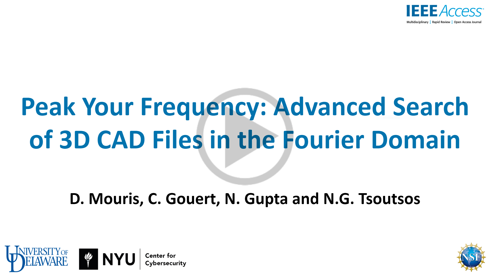

# Peak your Frequency: Advanced Search of 3D CAD Files in the Fourier Domain [![License MIT][badge-license]](LICENSE) [![Python 3][badge-python3]]((https://www.python.org/))

## Fourier Fingerprint Search (FFS) Overview

![alt text][overview]


#### Cite this work!

The publication describing the FFS framework can be accessed [here](https://ieeexplore.ieee.org/abstract/document/9153753).
To cite this work use:

```
D. Mouris, C. Gouert, N. Gupta and N. G. Tsoutsos,
"Peak Your Frequency: Advanced Search of 3D CAD Files in the Fourier Domain,"
in IEEE Access, vol. 8, pp. 141481-141496, 2020, doi: 10.1109/ACCESS.2020.3013284.
```

#### Watch our presentation on YouTube:

[  ](https://www.youtube.com/watch?v=UrJCqG__Du0)


## Installation
```
$ git clone https://github.com/TrustworthyComputing/Fourier-Fingerprint-Search.git
$ cd Fourier-Fingerprint-Search
$ pip3 install -r requirements.txt
```

## Usage
The file `main.py` invokes the FFS framework.
Proving the `-h` or `--help` command line argument prints a help message with the various parameters that can be passed to the framework.

```
$ python main.py -h
```

FFS supports two modes, `learn` and `search`. In the former, FFS populates the database while in the latter searches for potential matches to the file(s) given as command line arguments.

### Learn

For instance, the following command stores all the files from the `Bolts` directory to the database using 2 slices.
```
$ python main.py --mode learn --stl benchmarks/FabWave/Bolts --N 2
```

### Search

Here, our query is the `Bolts/07b46ed1-3801-45ad-9f42-5adfffb4e1c7-ascii.stl` 3D model using both the fine-grained and the neighborhoods techniques.
FFS returns the query as the first match and 4 similar ones.

```
$ python main.py --mode search --stl benchmarks/FabWave/Bolts/07b46ed1-3801-45ad-9f42-5adfffb4e1c7-ascii.stl --N 2 --neighborhoods --print_fine_grained

Files matched with benchmarks/FabWave/Bolts/07b46ed1-3801-45ad-9f42-5adfffb4e1c7-ascii.stl using the number of signatures :
	benchmarks/FabWave/Bolts/07b46ed1-3801-45ad-9f42-5adfffb4e1c7-ascii.stl	:	0.985
	benchmarks/FabWave/Bolts/634a2f17-872e-45d0-9650-faa70156afad-ascii.stl	:	0.119
	benchmarks/FabWave/Bolts/b8d3657b-a054-4c83-816c-9bce74c59724-ascii.stl	:	0.061
	benchmarks/FabWave/Bolts/4ced7e80-446c-42f1-bc05-5f1eb472198b-ascii.stl	:	0.035
	benchmarks/FabWave/Bolts/a773fc47-9f49-40d9-93ce-aa1ceeb10b00-ascii.stl	:	0.019


Files matched with benchmarks/FabWave/Bolts/07b46ed1-3801-45ad-9f42-5adfffb4e1c7-ascii.stl using the number of neighborhoods :
	benchmarks/FabWave/Bolts/07b46ed1-3801-45ad-9f42-5adfffb4e1c7-ascii.stl	:	1.0
	benchmarks/FabWave/Bolts/634a2f17-872e-45d0-9650-faa70156afad-ascii.stl	:	0.431
	benchmarks/FabWave/Bolts/b8d3657b-a054-4c83-816c-9bce74c59724-ascii.stl	:	0.293
	benchmarks/FabWave/Bolts/4ced7e80-446c-42f1-bc05-5f1eb472198b-ascii.stl	:	0.19
	benchmarks/FabWave/Bolts/a773fc47-9f49-40d9-93ce-aa1ceeb10b00-ascii.stl	:	0.172
```


<p align="left">
    
    This material is based upon work supported by the National Science Foundation under Grant No. 1931916. Any opinions, findings, and conclusions or recommendations expressed in this material are those of the author(s) and do not necessarily reflect the views of the National Science Foundation.
</p>


<p align="left">
    
    This material was developed by the Trustworthy Computing Group at the University of Delaware.
</p>


[overview]: ./images/overview.png

[badge-license]: https://img.shields.io/badge/license-MIT-green.svg?style=flat-square
[badge-python3]: https://img.shields.io/badge/python-3-blue.svg?style=flat-square
